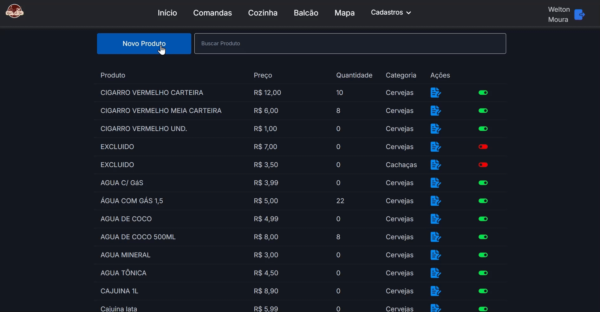

# RRBEC - Gestão de Bares e Restaurantes

## Sobre o Projeto
Este projeto é uma aplicação web desenvolvida em Django com o objetivo de explorar as funcionalidades e recursos desse framework. A aplicação visa simular um sistema de gestão para bares e restaurantes, abrangendo desde o cadastro de produtos e clientes até a geração de relatórios de vendas.


## Dashboard

* [x] Cards com faturamento vendas, e ticket médio.
* [x] Graficos - Produtos mais vendidos e tempos de preparo de petiscos.
* [x] Grafico de faturamento mês a mês do ano anterio, atual, e projeção.
* [x] Filtro por data (padrão últimos 30 dias).

## Produtos

* [x] Cadastrar e editar produtos.
* [x] Ativar/Desativar produtos direto da tela de lista de produtos com um só click.
* [x] Pesquisar produtos por nome.
* [x] Pesquisa reativa.
* [ ] Gerenciar o estoque de produto.

### Comandas
* [x] Abrir nova comanda(inserindo nome, associando ou não a mesa).
* [x] Editar informações da comanda.
* [x] Adicionar produtos na comanda.
* [x] Adicionar observação ao produto(somente item da cozinha).
* [x] Remover produtos da comanda.
* [x] Imprimir cupom de pagamento.
* [x] Imprimir fichas dos produtos.
* [x] Receber pagamento parcial.
* [x] Taxa de serviço opcional.
* [x] Fechamento da comanda.
* [x] Receber pagamento ou adicionar valor na conta do cliente.
* [x] Adicionar valor na conta do cliente.
* [x] Responsivo para mobile.

### Mesa
* [ ] Reserva de mesas.
* [x] Mapa de mesas.
* [x] Associar pedidos e comandas a mesas.
* [ ] Dividir contas.

### Clientes
* [x] Cadastrar novos clientes (nome, endereço, telefone, email).
* [x] Editar informações de clientes existentes.
* [ ] Excluir clientes.
* [ ] Consultar o histórico de pedidos de um cliente.

### Guarita
* [x] Adicionar produtos, quantidade.
* [x] Pesquisa produto reativa.
* [x] Exibição de produtos em ordem de maior saida.
* [x] Excluir produtos.
* [x] Impressão de fichas de consumo.
* [x] Atalhos do teclado para maior agilidade.
* [x] Calculo de troco do pagamento.

### Funcionários
* [X] Cadastrar novos funcionários.
* [x] Editar informações de funcionários existentes.
* [x] Excluir funcionários.
* [X] Gerenciar permissões de acesso.

### Relatórios
* [ ] Gerar relatório de vendas por período (diário, semanal, mensal).
* [ ] Gerar relatório de estoque (produtos em falta, produtos com alta rotatividade).
* [ ] Gerar relatório de clientes (mais ativos, menos ativos).
* [ ] Gerar relatório de funcionários (horas trabalhadas, faltas).

### Pagamentos
* [ ] Integrar com gateways de pagamento (cartão de crédito, débito, PIX).
* [x] Gerenciar formas de pagamento.
* [ ] Emitir notas fiscais eletrônicas.


### Delivery
* [ ] Cadastrar entregadores.
* [ ] Gerenciar rotas de entrega.
* [ ] Acompanhar pedidos em tempo real.

### Sistema
* [x] Gerenciar usuários do sistema (login, senha, permissões).
* [ ] Realizar backups do sistema.

## Tecnologias Utilizadas
* **Django:** Framework Python para desenvolvimento web.
* **Python:** Linguagem de programação principal do projeto.
* **HTML:** Linguagem de marcação para disponibilizar os elementos na pagina.
* **HTMX:** Biblioteca para deixar a pagina mais dinâmica, reduzindo a necessidade do js puro.
* **CSS:** Linguagem para estilizar a interface do usuário.
* **JavaScript:** Linguagem que executa a lógica da pagina do lado do cliente.

## Como Executar o Projeto
1. **Clonar o repositório:**
   ```bash
   git clone https://github.com/Pindoba/RRBEC.git
2. **Criar um ambiente virtual:**
   ```bash
    python -m venv [nome da sua preferencia]
    source venv/bin/activate
3. **Instalar as dependências:**
   ```bash
   pip install -r requirements.txt
4. **Executar as migrations:**
   ```bash
   python manage.py migrate
5. **Iniciar o servidor de desenvolvimento:**
   ```bash
   python manage.py runserver
